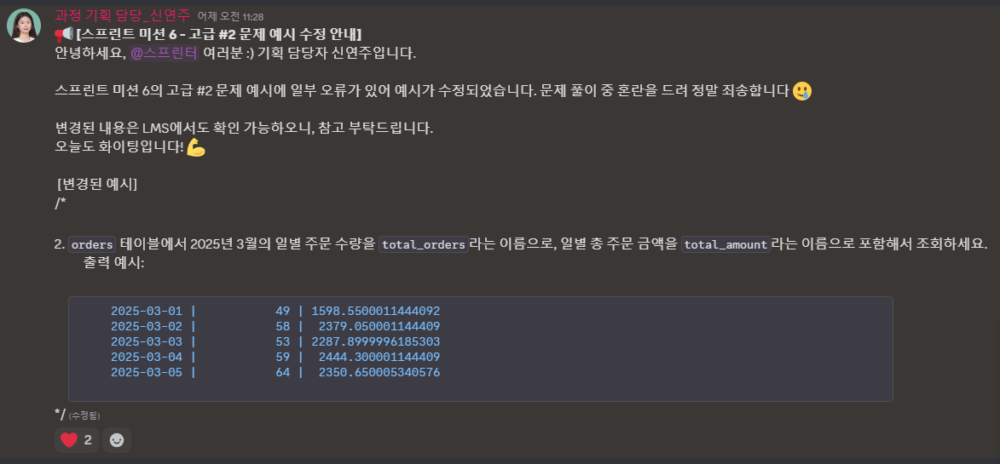

# 요구사항

기본 SQL 문법 연습 문제 풀어보기

- [x] PostgreSQL 설치 및 접속
- [x] pizza_place 데이터베이스 생성 및 접속
- [x] 미션용 데이터 pizza_place_sales.sql 다운로드 및 실행
- [x] 생성된 4개의 테이블 및 2개의 타입 확인

## 초급 문제

- [x] 1. `orders` 테이블에서 모든 주문을 조회하세요.
- [x] 2. `orders`테이블에서 `id` 가 `423`인 주문을 조회하세요.
- [x] 3. `orders` 테이블에서 총 주문 건수를 `total_orders`라는 이름으로 구하세요.
- [x] 4. `orders` 테이블에서 최신 순으로 주문을 조회하세요. (`date`, `time` 컬럼이 분리되어 있다는 점에 주의)
- [x] 5. `orders` 테이블에서 오프셋 기반 페이지네이션된 목록을 조회합니다. 페이지 크기가 10이고 최신순일 때, 첫 번째 페이지를 조회하세요.
- [x] 6. `orders` 테이블에서 오프셋 기반 페이지네이션된 목록을 조회합니다. 페이지 크기가 10이고 최신순일 때 5번째 페이지를 조회하세요.
- [x] 7. `orders` 테이블에서 커서 페이지네이션된 목록을 조회합니다. 페이지 크기가 10이고 최신순일때, `id` 값을 기준으로 커서를 사용합시다. 커서의 값이 `42`일 때 다음 페이지를 조회하세요.
- [x] 8. `orders` 테이블에서 2025년 3월에 주문된 내역만 조회하세요.
- [x] 9. `orders` 테이블에서 2025년 3월 12일 오전에 주문된 내역만 조회하세요.
- [x] 10. `pizza_types` 테이블에서 이름에 'Cheese' 혹은 'Chicken'이 포함된 피자 종류를 조회하세요. (대소문자를 구분합니다)

## 중급 문제

- [x] 1. `order_details` 테이블에서 각 피자(`pizza_id`)별로 주문된 건 수(`order_id`)를 보여주세요.
- [x] 2. `order_details` 테이블에서 각 피자(`pizza_id`)별로 총 주문 수량을 구하세요.
- [x] 3. `pizzas` 테이블에서 `price`의 크기가 20보다 큰 피자의 종류만 `order_details` 테이블에서 조회하세요. (힌트: 서브쿼리)
- [x] 4. `orders` 테이블에서 각 날짜별 총 주문 건수를 `order_count` 라는 이름으로 계산하고, 하루 총 주문 건수가 80건 이상인 날짜만 조회한 뒤, 주문 건수가 많은 순서대로 정렬하세요.
- [x] 5. `order_details` 테이블에서 피자별(`pizza_id`) 총 주문 수량이 10개 이상인 피자만 조회하고, 총 주문 수량 기준으로 내림차순 정렬하세요.
- [x] 6. `order_details` 테이블에서 피자별 총 수익을 `total_revenue` 라는 이름으로 구하세요. (수익 = `quantity * price`)
- [x] 7. 날짜별로 피자 주문 건수(`order_count`)와 총 주문 수량(`total_quantity`)을 구하세요.

## 고급 문제

- [x] 1. 피자별(`pizzas.id` 기준) 판매 수량 순위에서 피자별 판매 수량 상위에 드는 베스트 피자를 10개를 조회해 주세요. `pizzas`의 모든 컬럼을 조회하면서 각 피자에 해당하는 판매량을 `total_quantity`라는 이름으로 함께 조회합니다.

```sql
출력 예시:
    big_meat_s    | big_meat    | S    |    12 |           1914
    thai_ckn_l    | thai_ckn    | L    | 20.75 |           1410
    five_cheese_l | five_cheese | L    |  18.5 |           1409
    four_cheese_l | four_cheese | L    | 17.95 |           1316
    classic_dlx_m | classic_dlx | M    |    16 |           1181
    spicy_ital_l  | spicy_ital  | L    | 20.75 |           1109
    hawaiian_s    | hawaiian    | S    |  10.5 |           1020
    southw_ckn_l  | southw_ckn  | L    | 20.75 |           1016
    bbq_ckn_l     | bbq_ckn     | L    | 20.75 |            992
    bbq_ckn_m     | bbq_ckn     | M    | 16.75 |            956
```

- [x] 2.  `orders` 테이블에서 2025년 3월의 일별 주문 수량을 `total_orders`라는 이름으로, 일별 총 주문 금액을 `total_amount`라는 이름으로 포함해서 조회하세요.

```sql
출력 예시:
    2025-03-01 |           49 | 1598.5500011444092
    2025-03-02 |           58 |  2379.050001144409
    2025-03-03 |           53 | 2287.8999996185303
    2025-03-04 |           59 |  2444.300001144409
    2025-03-05 |           64 |  2350.650005340576
```

- [x] 3. `order`의 `id`가 78에 해당하는 주문 내역들을 조회합니다. 주문 내역에서 각각 주문한 피자의 이름을 `pizza_name`, 피자의 크기를 `pizza_size`, 피자 가격을 `pizza_price`, 수량을 `quantity`, 각 주문 내역의 총 금액을 `total_amount` 라는 이름으로 조회해 주세요.

```sql
출력 예시:
    The Thai Chicken Pizza      | S          |       12.75 |        1 |              12.75
    The Big Meat Pizza          | S          |          12 |        1 |                 12
    The Classic Deluxe Pizza    | S          |          12 |        1 |                 12
    The Italian Capocollo Pizza | M          |          16 |        1 |                 16
    The Spicy Italian Pizza     | L          |       20.75 |        3 |              62.25
    The Four Cheese Pizza       | L          |       17.95 |        1 | 17.950000762939453
```

- [x] 4. `order_details`와 `pizzas` 테이블을 JOIN해서 피자 크기별(S, M, L) 총 수익을 계산하고, 크기별 수익을 출력하세요.

```sql
출력 예시:
    L    |  375318.7010040283
    M    |          249382.25
    S    | 178076.49981307983
    XL   |              14076
    XXL  | 1006.6000213623047
```

- [x] 5. `order_details`, `pizzas`, `pizza_types` 테이블을 JOIN해서 각 피자 종류의 총 수익을 계산하고, 수익이 높은 순서대로 출력하세요.

```sql
출력 예시:
  The Thai Chicken Pizza                     |           43434.25
  The Barbecue Chicken Pizza                 |              42768
  The California Chicken Pizza               |            41409.5
  The Classic Deluxe Pizza                   |            38180.5
  The Spicy Italian Pizza                    |           34831.25
  The Southwest Chicken Pizza                |           34705.75
  The Italian Supreme Pizza                  |           33476.75
```

# 멘토에게

## 📝 특이사항 및 추가 설명

### 초급 문제

- 답안 쿼리가 비교적 짧아서 가독성을 크게 해치지 않는다고 판단하여 전체적으로 개행을 최소화 했습니다.
- **6번**: 페이지가 바뀌었을 때 OFFSET 수정이 쉽도록 수식으로 작성했습니다.
- **8번**: 풀이방법을 2가지 제시했습니다.
- **10번**: 만약 MySQL이었다면 기본적으로 대소문자를 구분하지 않으므로 BINARY를 사용하여 대소문자를 구분해야 함을 인지했습니다.

### 중급 문제

- **6, 7번**: ORDER BY 절은 임의로 추가했고, 고급 문제들의 ORDER BY는 출력 예시를 참고해서 작성했습니다.

### 고급 문제

- **2번**: 팀 내부 토의 중 출력 예시와 올바른 출력값이 다르다는 점을 발견했습니다. 주강사님께 문의드렸고 코드잇 측의 수용으로 출력 예시가 올바르게 수정되었습니다.
  

## 소감

미션 양에 비하여 배정된 시수가 비교적 많아서 여유롭게 진행했습니다. 고급 2번 문제를 잘못 작성할 뻔했는데 팀원간 코드 비교를 통해 오류를 바로잡을 수 있었습니다.
